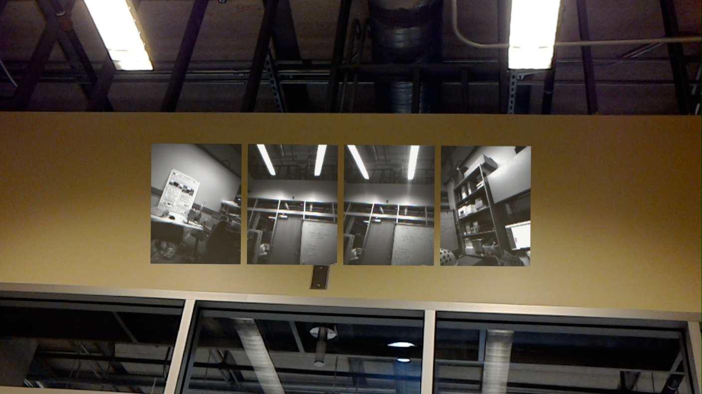

HoloLensMediaCaptureRawSensor
===

Author: Long Qian

Date: 2018-05-28

## Screenshot



## How to run

1. Build VS2017 project from Unity scene `MediaCaptureRawSensor.unity`
2. Open the VS2017 project, edit project `Assembly-CSharp` -> `Properties` -> `Build` -> `Allow unsafe code` to true
3. Open manifest file `HoloLensMediaCapture` -> `Package.appxmanifest` -> `View code`, then modify part of the code:
```
<Package
	xmlns="http://schemas.microsoft.com/appx/manifest/foundation/windows10"
	xmlns:mp="http://schemas.microsoft.com/appx/2014/phone/manifest"
	xmlns:uap="http://schemas.microsoft.com/appx/manifest/uap/windows10"
	xmlns:rescap="http://schemas.microsoft.com/appx/manifest/foundation/windows10/restrictedcapabilities"
	IgnorableNamespaces="uap mp rescap"
>
......
<Capabilities>
	<rescap:Capability Name="perceptionSensorsExperimental"/>
	<DeviceCapability Name="webcam"/>
	......
</Capabilities>
```
4. Deploy to HoloLens. Use **clicker** or **air tap** to Start/Stop the raw sensors

Note: You **MUST** stop the raw sensors before quitting the application. Otherwise the raw sensors will not be able to properly run for HoloLens SLAM. You will need to **RESTART** HoloLens if that happens.

## Note

You need to enable research mode in HoloLens first, and this project is tested with Unity 2017.4.4f1 and Visual Studio 2017.
